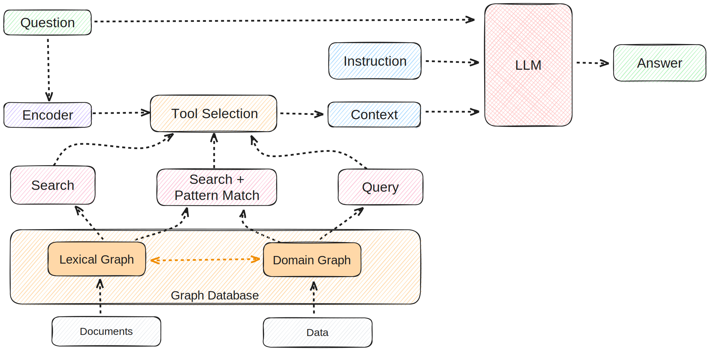

\# RAG Practice
<p align="center">
  
</p>


A collection of experiments, implementations, and notes while learning Retrieval-Augmented Generation (RAG), modern retrieval techniques, and agentic AI systems.


> \*\*Repository Status:\*\* Active Development


\---


\## Overview


This repository documents my journey of understanding and implementing Retrieval-Augmented Generation systems using modern AI frameworks. The goal is to explore how different retrieval strategies, embedding models, vector databases, and agent workflows affect the performance of LLM-powered applications.


Rather than maintaining a single project, this repository contains independent experiments and implementations that focus on one concept at a time.


\---


\## Objectives


\* Build RAG systems from scratch

\* Explore different retrieval techniques

\* Compare embedding models

\* Benchmark vector databases

\* Learn LangChain and LangGraph

\* Implement agentic RAG workflows

\* Understand production-ready architectures

\* Study evaluation techniques for RAG systems


\---


\## Technologies


\* Python

\* LangChain

\* LangGraph

\* ChromaDB

\* FAISS

\* Pinecone

\* Milvus

\* OpenAI

\* Groq

\* Hugging Face

\* Ollama

\* Pydantic

\* FastAPI

\* UV


\---


\## Repository Structure


```text

rag-practice/

│

├── basic-rag/

├── loaders/

├── text-splitting/

├── embeddings/

├── vectorstores/

├── retrievers/

├── prompts/

├── conversational-rag/

├── evaluation/

├── agentic-rag/

├── graph-rag/

├── experiments/

├── assets/

└── README.md

```


\---


\## Topics Covered


\### Foundations


\* RAG Pipeline

\* Document Loading

\* Text Chunking

\* Embeddings

\* Vector Databases

\* Similarity Search


\### Retrieval


\* Similarity Retriever

\* MMR Retriever

\* Multi Query Retriever

\* Parent Document Retriever

\* Self Query Retriever

\* Ensemble Retriever

\* Contextual Compression

\* Hybrid Search


\### Generation


\* Prompt Engineering

\* Context Injection

\* Query Rewriting

\* Response Generation

\* Citation Generation


\### Advanced


\* Conversational RAG

\* Agentic RAG

\* Graph RAG

\* Multi-Agent Systems

\* Long-Term Memory

\* Tool Calling

\* MCP Integration


\### Evaluation


\* Retrieval Evaluation

\* Hallucination Analysis

\* RAG Metrics

\* Latency Benchmarking


\---


\## Progress


| Module               | Status      |

| -------------------- | ----------- |

| Basic RAG            | Complete    |

| Document Loading     | Complete    |

| Text Splitting       | Complete    |

| Embeddings           | In Progress |

| Vector Stores        | In Progress |

| Retriever Strategies | Planned     |

| Agentic RAG          | Planned     |

| Graph RAG            | Planned     |

| Evaluation           | Planned     |


\---


\## Learning Goals


\* Understand retrieval architectures

\* Compare retrieval strategies

\* Build production-ready RAG pipelines

\* Learn orchestration with LangGraph

\* Explore agentic workflows

\* Improve context quality and retrieval accuracy


\---


\## Future Work


\* Hybrid Search

\* SQL RAG

\* Knowledge Graph RAG

\* Multimodal RAG

\* Production Deployment

\* Evaluation Dashboard

\* Streaming Responses

\* RAG API

\* Authentication

\* Docker Deployment

\* Kubernetes Deployment


\---


\## References


\* LangChain

\* LangGraph

\* ChromaDB

\* FAISS

\* Hugging Face

\* OpenAI

\* Groq

\* Anthropic

\* Pinecone

\* Milvus


\---


\## License


This repository is intended for learning, experimentation, and educational purposes.


